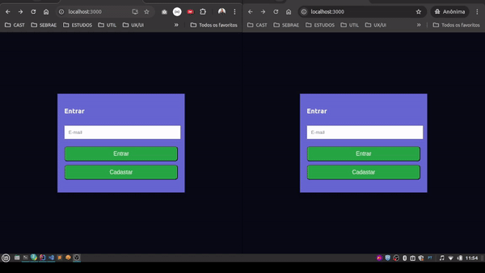

# WebChat Frontend

> Este projeto é a implementação do frontend para uma aplicação de WebChat com salas e atualizações em tempo real, utilizando WebSockets.  
> Para rodar completamente o projeto, é necessário executar o backend disponível neste link: [`webchat-backend`](https://github.com/samuelJunnior/webchat-backend).

## Sumário

- [Preview](#-preview)
- [Tecnologias](#-tecnologias)
  - [Desenvolvimento](#desenvolvimento)
- [Pré-requisitos](#-pr-requisitos)
- [Build e Execução local](#-build-e-execuo-local)
- [Colaboradores](#-colaboradores)

## Preview



## 💻 Tecnologias

### Desenvolvimento

- Comunicação com WebSockets usando `@stomp/stompjs` e `sockjs-client`.
- Gestão de estado do frontend com React.
- Estilização dinâmica com `styled-components`.
- API REST consumida via `axios`.
- Notificações usando `react-toastify`.
- Modal de diálogo com `react-responsive-modal` e `react-modal`.
- Roteamento de páginas com `react-router-dom`.

## 💻 Pré-requisitos

- Você precisa ter o `Node.js` e o `npm` instalados e configurados.
- O backend (Spring Boot) deve estar rodando para que o frontend se comunique corretamente com as APIs.
- Se você usar Docker para o backend, certifique-se de que todos os containers estão rodando e que ajuste a URL no arquivo [`.env`](./.env)

## 🚀 Build e Execução local

Para rodar o projeto localmente, siga os passos abaixo:

1. Clone o repositório:

   ```bash
   git clone https://github.com/samuelJunnior/webchat-frontend.git
   ```

2. Instale as dependências:

   ```bash
   npm install
   ```

3. Para iniciar o servidor de desenvolvimento:
   ```bash
   npm start
   ```

A aplicação ficará disponível no endereço [http://localhost:3000](http://localhost:3000).

## 🤝 Colaboradores

Agradecemos às seguintes pessoas que contribuíram para este projeto (contém ironia):

<table>
  <tr>
    <td align="center">
      <a href="#">
         <br>
        <sub>
          <b>Samuel Junior</b>
        </sub>
      </a>
    </td>
    <td align="center">
      <a href="#">
        <br>
        <sub>
          <b>Mark Zuckerberg</b>
        </sub>
      </a>
    </td>
    <td align="center">
      <a href="#">
        <br>
        <sub>
          <b>Steve Jobs</b>
        </sub>
      </a>
    </td>
  </tr>
</table>
